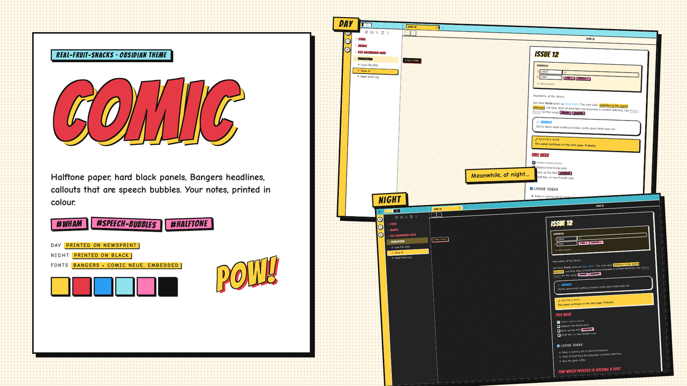
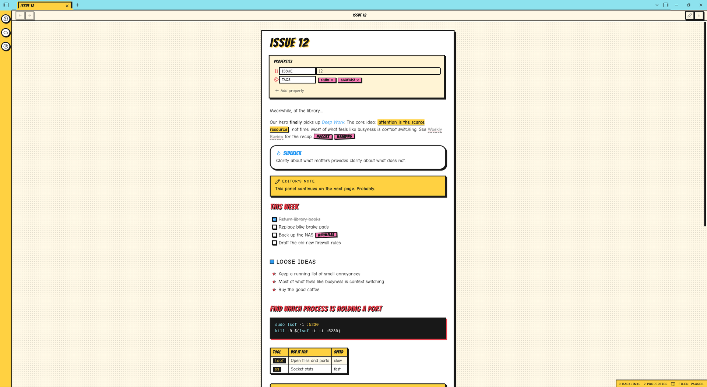
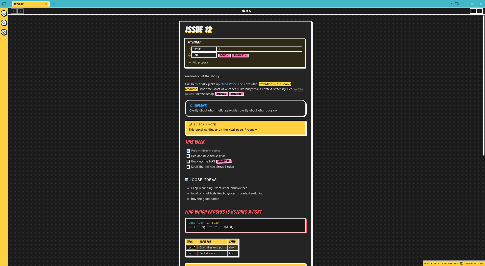

  

# Comic

Your notes, printed in colour. Halftone paper, a hard black panel around every note, Bangers headlines with a yellow drop — and one trick: **callouts are speech bubbles.**

Tips and hints are rounded bubbles with a coloured Bangers title. Notes and info are square yellow caption boxes ("Meanwhile, at the library…"). Warnings are yellow burst boxes with a **WHAM!** in the corner. Quotes are rounder and italic. It reads like a page, not a form.

## What it does

- Halftone-dot paper; the note sits inside a 3px black panel with a hard 6px offset shadow
- Bangers headlines: H1 with a yellow drop, red H2 with a black drop; Comic Neue body — both embedded, nothing to install
- Speech-bubble callouts: bubbles for tips, caption boxes for notes, WHAM! burst boxes for warnings, italic bubbles for quotes, collapsible question bubbles
- Tags are pink stickers, tilted a couple of degrees in Reading view; highlights are yellow with an offset shadow
- Code blocks are black narration boxes with yellow text, a red offset shadow and a pink language flair — in Reading view and in the editor
- Cyan tab strip with boxed tabs, yellow ribbon with round badge buttons, yellow status bar, a POW! at the foot of the file explorer
- Bangers table headers, 3px boxed checkboxes that fill blue, offset-shadow menus and modals, boxed tooltips
- Day mode: printed on newsprint. Night mode: the same page printed on black, with white ink lines

  

  

## Install

**From the community list** — Settings → Appearance → Themes → Manage → search "Comic".

**Manually**

1. Download `theme.css` and `manifest.json` from the [latest release](https://github.com/Real-Fruit-Snacks/obsidian-comic/releases/latest).
2. Put them in `<your vault>/.obsidian/themes/Comic/`.
3. Settings → Appearance → Themes → Comic.

Readable line length on is recommended — the panel and its shadow sit in the halftone around a centred page.

## Palette

| Role | Day | Night |
|---|---|---|
| Paper | `#FFF8E7` | `#141414` |
| Panel | `#FFFFFF` | `#1F1F1F` |
| Ink | `#111111` | `#F5F5F5` |
| Yellow | `#FFD23F` | `#FFD23F` |
| Red | `#E63946` | `#FF5A66` |
| Blue | `#2A9DF4` | `#4FB0FF` |
| Cyan | `#8EE3EF` | `#3FB8C9` |
| Pink | `#FF7AB6` | `#FF7AB6` |

## Contributing

Issues and pull requests welcome. No build step: edit `theme.css`, reload Obsidian. `dev/` holds the same file with a note on where it goes in a vault.

## License

MIT. Fonts (Bangers, Comic Neue) are under the SIL Open Font License.
